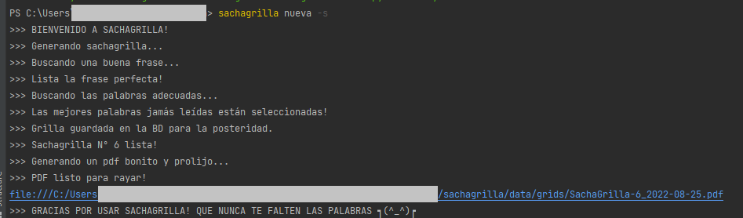
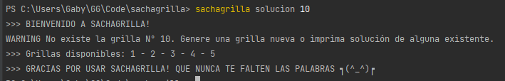

# sachagrilla
> Una app cli para generar grillas (estilo crucigrama) en pdf. Los datos usados se recolectan de la web. 


[](https://github.com/gonzalezgbr/sachagrilla/graphs/commit-activity)

*Una grilla combina la resolución de definiciones con el descubrimiento de una frase clave. Como ayuda se proveen las sílabas que componen las palabras.*

`sachagrilla` es una cli app con la que puedes generar grillas en pdf para jugar en tus ratos libres!
Las grillas no están predefinidas sino que se generan "a pedido" de forma aleatoria en base a las frases, palabras y significados guardados en la base de datos.
Mejor aún, los datos de la base de datos se descargan de la web, con lo que se pueden seguir actualizando constantamente! 

## Instalación

> ⚠️ *Por el momento, `sachagrilla` solo se puede instalar como un paquete Python, es decir, tienes que tener Python y pip instalado en tu sistema.*   

1. Descargar `.whl` de la carpeta `dist/` de este repo.
2. En una terminal ejecutar: 

- OS X & Linux:

```shell
python3 -m pip install nombre_del_wheel_.whl
```
   
- Windows:

```shell
py -m pip install nombre_del_wheel.whl 
```

## Como usar

Sachagrilla tiene 3 funciones disponibles:
- Generar una grilla nueva con datos aleatorios de la BD. Se puede incluir la solución en la impresión o no.
- Imprimir la solución de una grilla existente
- Recolectar nuevos datos de la web.


### Generar nueva grilla

```shell
sachagrilla nueva -s 
```
Si no se quiere incluir la solución, omitir la opción `-s`. Se genera un pdf y se proporciona su enlace en la consola.




### Imprimir solución de una grilla existente

```shell
sachagrilla solucion 10 
```

Se debe indicar el número de grilla del cual se quiere la solución. 
Si la grilla existe, se genera un pdf y se proporciona su enlace en la consola. Si no existe, se muestran los números de
grilla disponibles.




### Recolectar datos de la web

Para recolectar más datos se descargan frases, palabras y su significado, de las grillas de un diario argentino. 
Opcionalmente, se puede indicar cuantas páginas recolectar, por defecto se descargan 5.

```shell
sachagrilla recolectar -c 2
```


Mirá que linda que queda una grilla generada!

[SachaGrilla-1_2022-08-25.pdf](docs/SachaGrilla-1_2022-08-25.pdf)


## Release History

* 0.1.0 | Primer release


## Meta

By GG - [@GargaraG](https://twitter.com/GargaraG) 

Distribuido bajo licencia Apache. Ver ``LICENSE`` para más información.

[https://github.com/gonzalezgbr/](https://github.com/gonzalezgbr/)


